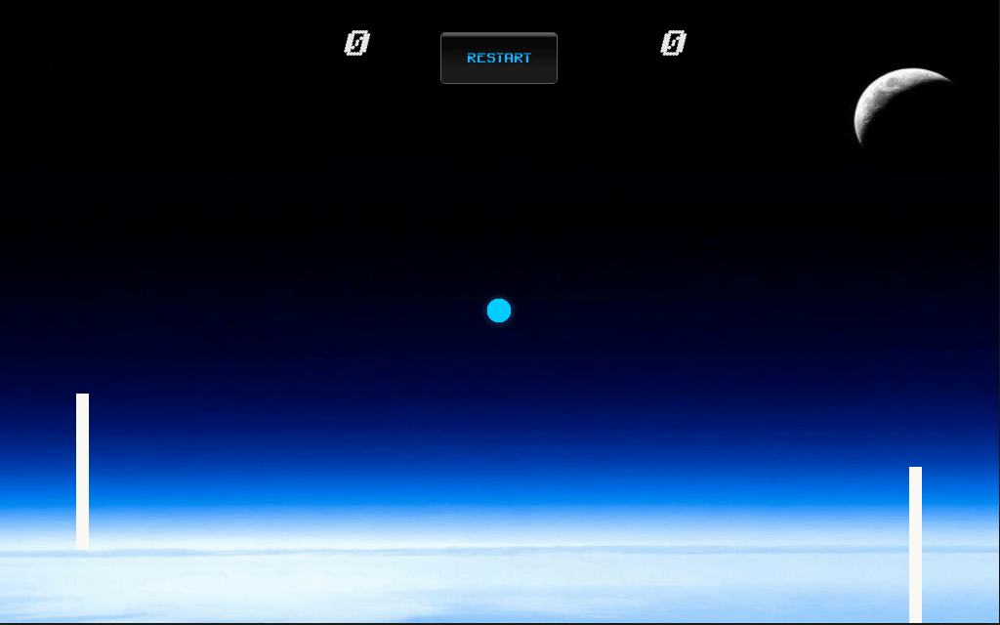

# ClassicPong
## Prototype of the famous Pong game using Unity.

### USAGE:

1. Unzip files (ClassicPongLinux_v1.0.zip OR ClassicPongWindows_v1.0.rar)

2. On Windows, launch the ".exe" file in folder "ClassicPongWindows_v1.0". 

3. On Linux, run `cd ClassicPongLinux_v1.0 && ./ClassicPong.x86_64`.

- Fun Fact:
-> If you score, your opponent get the point! (on Linux).

# Classic Pong Preview

